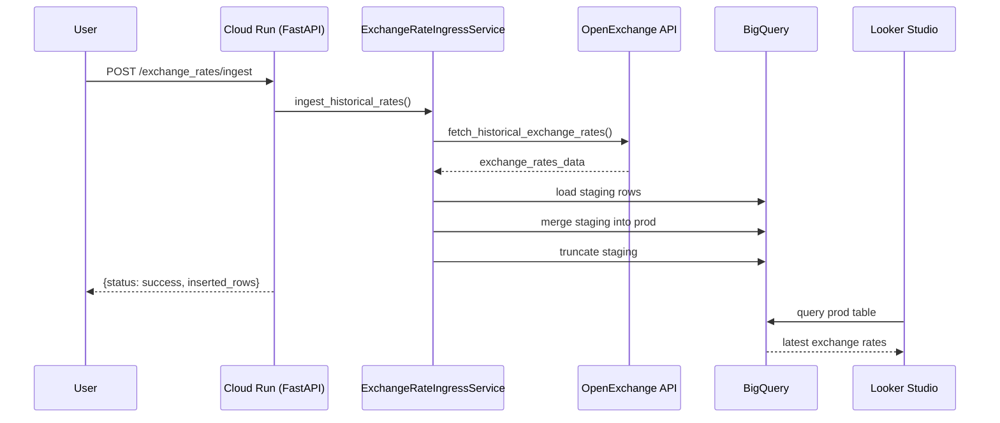
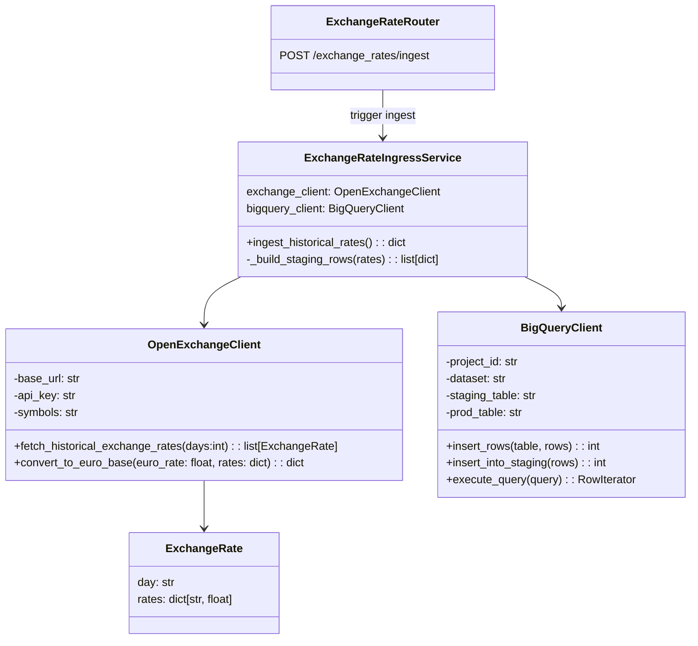

# exchange-rate-service
service for updating exchange rates in google cloud

## Getting Started

```bash
# Install dependencies with uv (installs into an isolated environment)
uv sync

# Run the FastAPI app locally (default port 8000)
uv run fastapi dev app/main.py --host 0.0.0.0 --port 8000
```

### Design

#### Ingestion Sequence



#### Domain Overview idea --> will be updated


