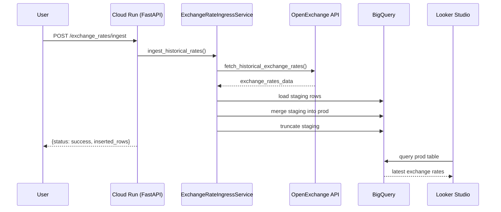
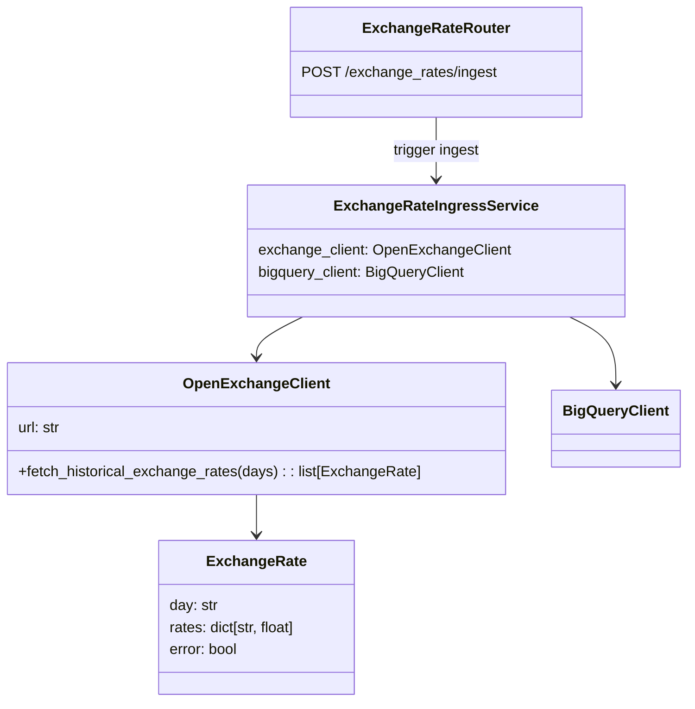

# exchange-rate-service
service for updating exchange rates in google cloud

### Design

#### Ingestion Sequence

```mermaid
sequenceDiagram
    participant User as User
    participant CloudRun as Cloud Run (FastAPI)
    participant Ingress as ExchangeRateIngressService
    participant OpenFX as OpenExchange API
    participant BQ as BigQuery
    participant Looker as Looker Studio

    User->>CloudRun: POST /exchange_rates/ingest
    CloudRun->>Ingress: ingest_historical_rates()
    Ingress->>OpenFX: fetch_historical_exchange_rates()
    OpenFX-->>Ingress: exchange_rates_data
    Ingress->>BQ: load staging rows
    Ingress->>BQ: merge staging into prod
    Ingress->>BQ: truncate staging
    CloudRun-->>User: {status: success, inserted_rows}
    Looker ->> BQ: query prod table
    BQ -->> Looker: latest exchange rates

```

#### Domain Overview idea --> will be updated

```mermaid
classDiagram
    class OpenExchangeClient {
        url: str
        +fetch_historical_exchange_rates(days): list[ExchangeRate]

    }

    class ExchangeRate {
        day: str
        rates: dict[str, float]
        error: bool

    }

    class BigQueryClient {

    }

    class ExchangeRateIngressService {
        exchange_client: OpenExchangeClient
        bigquery_client: BigQueryClient

    }

    class ExchangeRateRouter {
        POST /exchange_rates/ingest
    }

    ExchangeRateIngressService --> OpenExchangeClient
    ExchangeRateIngressService --> BigQueryClient
    OpenExchangeClient --> ExchangeRate
    ExchangeRateRouter --> ExchangeRateIngressService : trigger ingest
```
