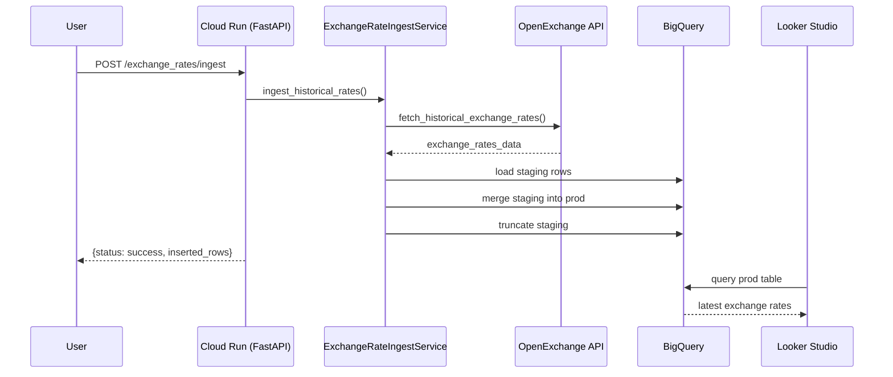
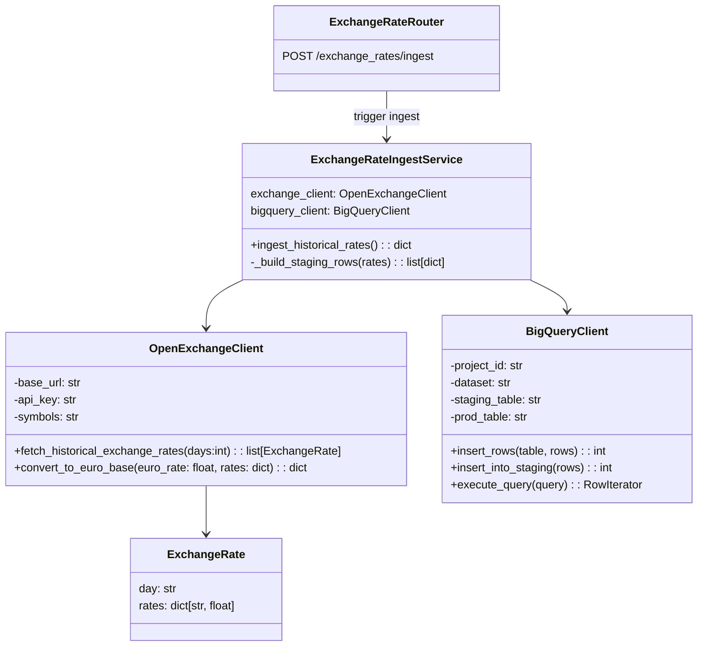
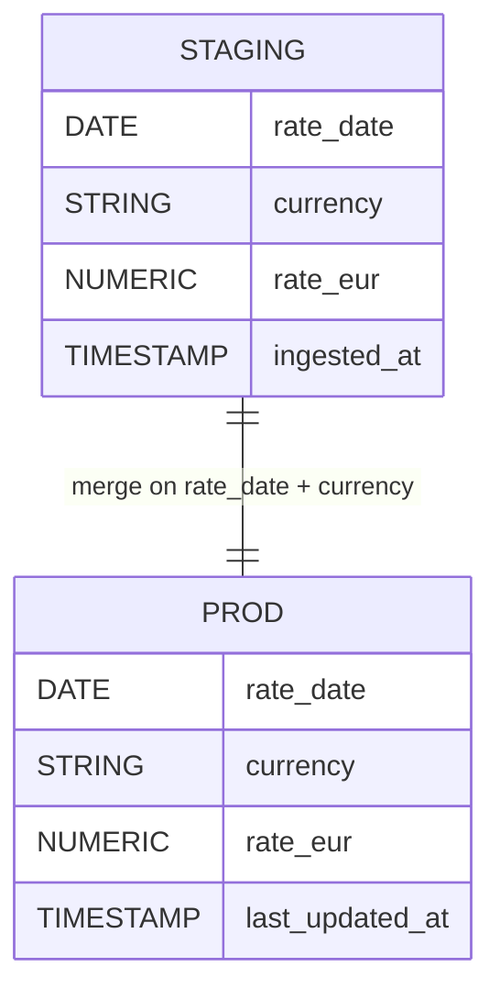

# Architecture

## Ingestion Sequence

## Domain Overview

## Data Model

## Update Strategy

This pipeline uses a `MERGE` to keep the production table synchronized with the latest rates:
- Daily payloads are small, so merging a few rows is operationally cheap.
- `MERGE` statements update changed currencies and insert new ones in a single job, keeping the table current without extra deduplication steps.
- A single prod table stays query-ready for Looker, instead of maintaining an additional self-updating view over append-only history.

After each merge, the staging table is truncated to keep the next ingest run clean:
- Clearing staging avoids accidentally reprocessing stale rows or inflating merge windows.
- Truncate operations in BigQuery are metadata-only, so they finish quickly even for large tables.
- Keeping staging empty between loads simplifies monitoring and makes it obvious if a run fails before merge.
